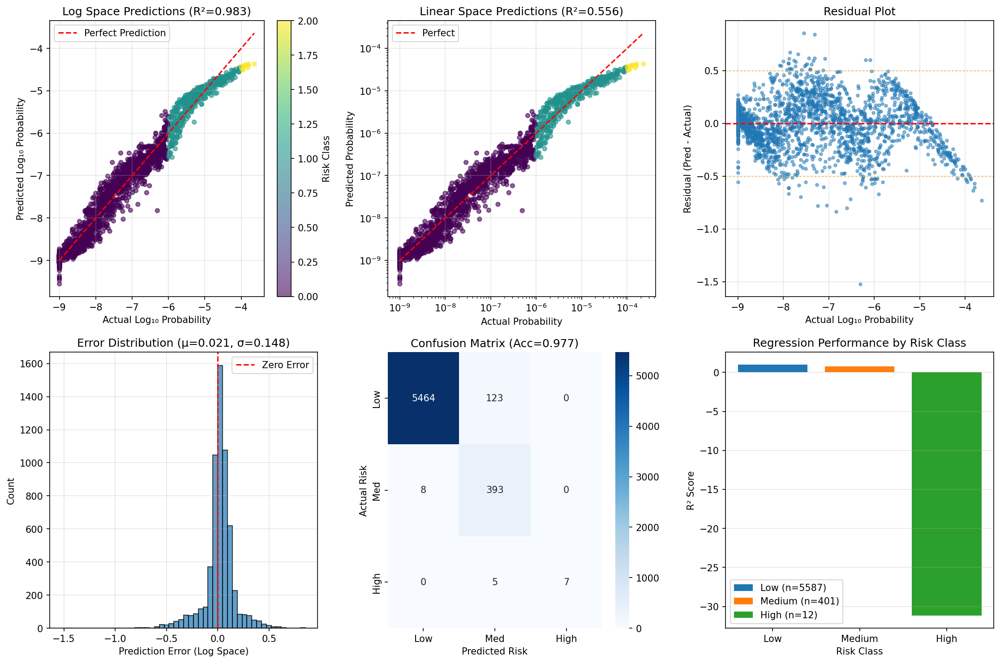
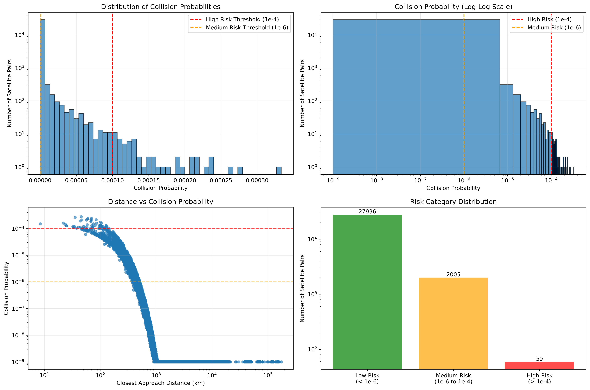
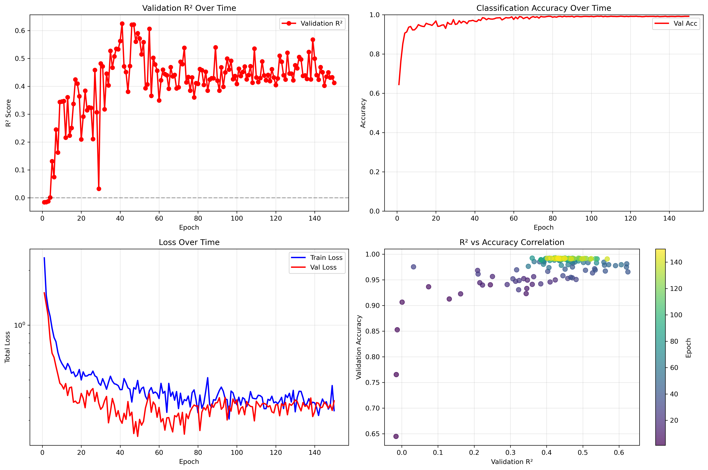

# 🛰️ Satellite Collision Risk Prediction System

A deep learning system for predicting collision probabilities and risk classifications between satellites in Earth's orbit, using real orbital mechanics data from the Space-Track API.

## 📊 Key Results

- **98.3% R²** for collision probability regression (log space)
- **97.7% classification accuracy** for risk level prediction
- **98.7% of predictions within 0.5 orders of magnitude** of true collision probability
- Successfully handles extreme data ranges (1e-9 to 1e-4 probability range)



## 🚀 Features

- **Multi-task neural network**: Simultaneously predicts exact collision probability and risk classification
- **Physics-based probability calculation**: Uses orbital mechanics principles including closest approach distance, relative velocity, altitude difference, inclination, and eccentricity
- **Real-time data pipeline**: Fetches and processes TLE data from Space-Track API
- **Stabilized training**: Implements advanced techniques for training on log-space probabilities
- **Risk categorization**: Based on NASA/ESA operational thresholds (High >1e-4, Medium 1e-6 to 1e-4, Low <1e-6)

## 🛠️ Installation

### Prerequisites
- Python 3.11+
- CUDA-capable GPU (optional but recommended)
- Space-Track API credentials

### Setup

1. Clone the repository:
```bash
git clone https://github.com/yourusername/satellite-collision-risk.git
cd satellite-collision-risk
```

2. Create conda environment:
```bash
conda env create -f environment.yml
conda activate space-debris
```

3. Install PyTorch (if not included in environment.yml):
```bash
pip install torch torchvision torchaudio --index-url https://download.pytorch.org/whl/cu128
```

4. Configure Space-Track credentials in `config.py`:
```python
SPACETRACK_USERNAME = "your_email@example.com"
SPACETRACK_PASSWORD = "your_password"
```

## 📁 Project Structure

```
satellite-collision-risk/
│
├── config.py                # Configuration and hyperparameters
├── data_acquisition.py      # Space-Track API interface
├── orbital_features.py      # Orbital mechanics calculations
├── data_utils.py            # Data processing utilities
├── collision_model.py       # Neural network architecture
├── preprocess.py            # Data preprocessing pipeline
├── train.py                 # Training script
├── test.py                  # Model evaluation
├── training_metrics.py      # Training visualization
├── visualization.py         # Results visualization
└── environment.yml          # Conda environment specification
```

## 🎯 Usage

### 1. Data Collection and Preprocessing
```bash
python preprocess.py
```
This will:
- Fetch TLE data for 500 active satellites
- Calculate closest approach distances for 30,000 satellite pairs
- Compute collision probabilities using multi-factor physics model
- Cache processed data for training



### 2. Model Training
```bash
python train.py
```
Trains the multi-task neural network with:
- Log-space probability regression
- Risk classification
- Automatic learning rate scheduling
- Best model checkpointing



### 3. Model Evaluation
```bash
python test.py
```
Evaluates the trained model on the test set and generates comprehensive visualizations.

## 🧠 Model Architecture

### Multi-Task Neural Network
- **Shared Feature Extractor**: 3-layer network with batch normalization and dropout
- **Regression Head**: Predicts log₁₀ collision probability with soft clamping
- **Classification Head**: 3-class risk level prediction
- **Input Features** (7): 
  - Closest approach distance (km)
  - Relative velocity (km/s)
  - Altitude difference (km)
  - Inclination difference (degrees)
  - Energy ratio
  - Satellite 1 eccentricity
  - Satellite 2 eccentricity

### Training Stabilization Techniques
- **Log-space training**: Handles 5 orders of magnitude range
- **Soft clamping**: `3.5 * tanh(x/3.5) - 6.5` keeps predictions in valid range
- **Gradient clipping**: Prevents training instability
- **Fixed loss scaling**: Replaces unstable variance normalization
- **Class weighting**: Handles imbalanced dataset (93% low risk, 7% medium, 0.2% high)

## 📈 Performance Metrics

### Test Set Results
```
Regression Performance:
  Log Space R²:  0.9828
  Linear Space R²: 0.5559
  Within 0.5 orders of magnitude: 98.7%
  Within 1.0 orders of magnitude: 100.0%

Classification Performance:
  Overall Accuracy: 97.73%
  
  Per-Class Performance:
              precision    recall  f1-score   support
    Low Risk     0.9985    0.9780    0.9882      5587
 Medium Risk     0.7543    0.9800    0.8525       401
   High Risk     1.0000    0.5833    0.7368        12
```

## 🔬 Technical Details

### Collision Probability Calculation
The system uses a multi-factor physics model:
```python
P = base_prob × velocity_factor × altitude_factor × inclination_factor × eccentricity_factor
```

Where:
- **Base probability**: Exponential decay based on closest approach distance
- **Velocity factor**: Higher relative velocity increases risk
- **Altitude factor**: Similar altitudes increase interaction probability
- **Inclination factor**: Similar orbital planes increase crossing frequency
- **Eccentricity factor**: Higher eccentricity slightly increases risk

### Data Pipeline
1. **TLE Acquisition**: Fetches Two-Line Element data from Space-Track
2. **Orbital Propagation**: Uses Skyfield to compute satellite positions over 24 hours
3. **Closest Approach**: Calculates minimum distance between satellite pairs
4. **Feature Engineering**: Extracts orbital parameters and collision metrics
5. **Risk Classification**: Categorizes based on NASA/ESA thresholds

---
*Deep learning model for satellite collision risk assessment, combining physics-based feature engineering with neural networks to classify risk levels and predict collision probabilities.*